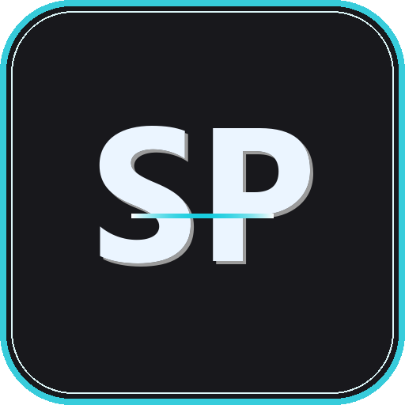

<p align="center">
  
</p>

# ScreenPrompt

**Your notes, scripts, and reminders — visible to you, invisible to everyone else.**

ScreenPrompt is a transparent, always-on-top overlay for Windows. You can read it; screen shares and recordings can't. It's excluded from capture in OBS, Zoom, Teams, and Windows' own Snipping Tool, so you can keep notes on screen during a call or stream without anyone seeing them.


[](https://tooomm.github.io/github-release-stats/?username=dan0dev&repository=ScreenPrompt)


<table>
<tr>
<th width="50%" align="center">Your Screen</th>
<th width="50%" align="center">What Others See</th>
</tr>
<tr>
<td align="center"></td>
<td align="center"></td>
</tr>
<tr>
<td align="center"><em>Overlay visible on your display</em></td>
<td align="center"><em>Overlay invisible during screen share</em></td>
</tr>
</table>

## Features

- **Capture-proof overlay** — excluded from OBS, Zoom, Teams, and Snipping Tool
- **Transparent & always-on-top**
- **Click-through mode** — lock the overlay so clicks pass through to the app beneath
- **Customizable appearance** — opacity, font family, font size, text and background color
- **Keyboard shortcuts** for everything, no mouse required
- **Keyboard layout support** — auto-detects Hungarian (QWERTZ) or English (QWERTY), with a manual override
- **Position presets** — snap to screen corners or center
- **Persistent settings** across sessions
- **100% local** — no network access, no data collection, no telemetry

## Requirements

Windows 10 (Build 2004+) or Windows 11.

## Installation

### Windows installer (recommended)

1. Go to [Releases](../../releases)
2. Download `ScreenPrompt_{version}_x64-setup.exe` and run it
3. Launch from the Start Menu or Desktop

If you're upgrading from the older Python-based version, the new installer replaces it.

### Build from source

Requires [Node.js](https://nodejs.org/) 20+ and [Rust](https://rustup.rs/) 1.77+.

```bash
git clone https://github.com/dan0dev/ScreenPrompt.git
cd ScreenPrompt/screenprompt-tauri
npm install
npm run tauri build
```

The installer is written to `src-tauri/target/release/bundle/nsis/`.

## Usage

- **Drag the title bar** to move the window
- **Drag the bottom edge** to resize
- **Click the gear icon** to open settings
- **Click the lock icon** to toggle click-through mode

### Keyboard shortcuts

| Shortcut | Action |
|----------|--------|
| `Ctrl+Shift+H` | Hide/show overlay |
| `Ctrl+Shift+L` | Toggle lock (click-through) |
| `Ctrl+Shift+E` | Quick edit mode |
| `Escape` | Emergency unlock |
| `Ctrl+Shift+PageUp` | Increase font size |
| `Ctrl+Shift+PageDown` | Decrease font size |
| `Ctrl+Shift+Home` | Reset font size |
| `Ctrl+Shift+O` | Cycle opacity |
| `Ctrl+Shift+S` | Open settings |
| `Ctrl+Shift+Q` | Quit (normal close, with cleanup) |
| `Ctrl+Shift+F1` | Panic — instant close, no confirmation, works even when locked |
| `Ctrl+Shift+C` | Copy all text |
| `Ctrl+Shift+V` | Paste and replace all text |
| `Ctrl+Shift+Delete` | Clear all text |

### Position presets

Shortcuts depend on your keyboard layout (auto-detected, or set manually in Settings):

| Position | English (QWERTY) | Hungarian (QWERTZ) |
|----------|-------------------|---------------------|
| Top-left / center / right | `Ctrl+Alt+7/8/9` | `Ctrl+Shift+7/8/9` |
| Center-left / center / right | `Ctrl+Alt+4/5/6` | `Ctrl+Shift+4/5/6` |
| Bottom-left / center / right | `Ctrl+Alt+1/2/3` | `Ctrl+Shift+1/2/3` |
| Nudge window 20px | `Ctrl+Shift+Arrows` | `Ctrl+Shift+Arrows` |

## Configuration

Settings persist locally and include window position/size, opacity, font family and size, text/background color, keyboard layout, and lock state.

## Use cases

Built for reading notes naturally while on camera: client calls and sales meetings, scripted streams and tutorials, speaker notes during presentations, meeting agendas and interview questions.

Not for cheating on exams, violating academic integrity policies, or breaking a platform's terms of service. You're responsible for how you use it.

## Privacy

Runs entirely on your machine — no network access, no data collection, no telemetry, no external servers.

## License

[MIT](LICENSE). Provided "as is", without warranty of any kind; the authors aren't responsible for misuse.

## Contributing

Contributions are welcome — see [CONTRIBUTING.md](CONTRIBUTING.md) before opening a pull request.

## Support

- [Report a bug](../../issues/new?template=bug_report.md)
- [Request a feature](../../issues/new?template=feature_request.md)
